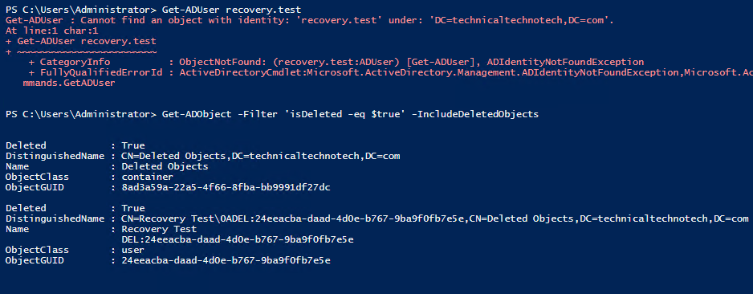
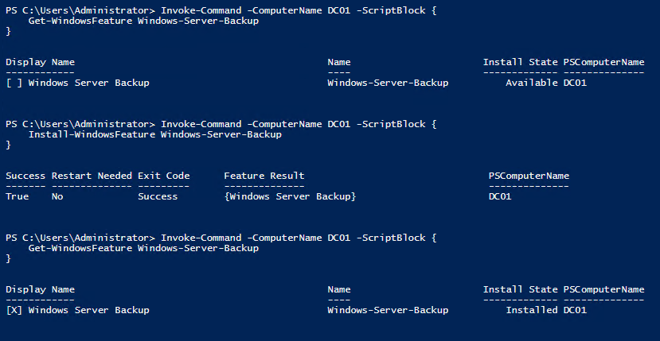
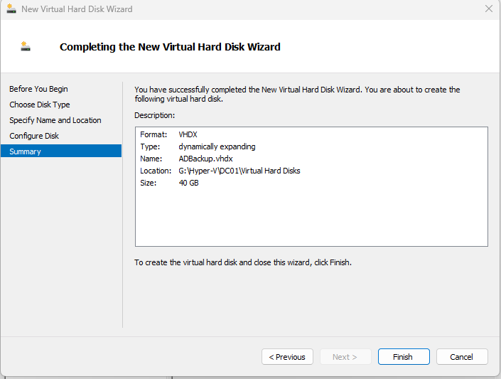
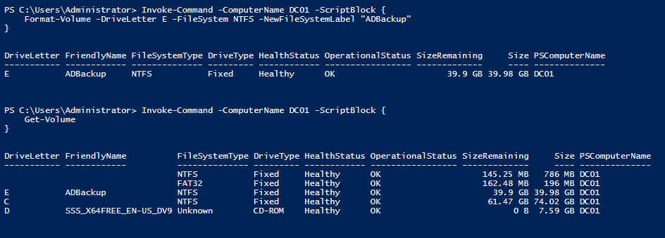
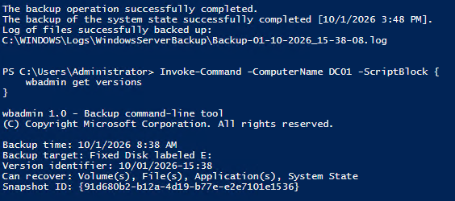
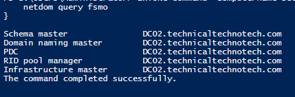
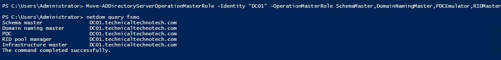

# AD DS Backup, Recovery & Disaster Recovery

## Project Overview

This project focused on protecting and recovering an Active Directory Domain Services (AD DS) environment.

The lab covered multiple levels of recovery, ranging from restoring an accidentally deleted Active Directory object to creating a System State backup for domain controller recovery.

I also practiced Flexible Single Master Operations (FSMO) role management by transferring all five FSMO roles between domain controllers and verifying Active Directory health afterward.

More disruptive disaster recovery procedures, including non-authoritative restore, authoritative restore, and FSMO seizure, were studied as recovery workflows rather than performed against the healthy production-style lab environment.

***

## Lab Environment

### Domain

`technicaltechnotech.com`

NetBIOS domain name:

`TTT`

### Servers and Workstations

| Device | Purpose |
|---|---|
| DC01 | Primary Windows Server domain controller |
| DC02 | Windows Server Core domain controller |
| MGMT01 | Windows 11 administrative workstation |
| CLIENT01 | Windows 11 domain-joined test workstation |

### Technologies Used

- Windows Server
- Windows Server Core
- Active Directory Domain Services
- Active Directory Administrative Center
- Active Directory PowerShell Module
- Active Directory Recycle Bin
- Windows Server Backup
- PowerShell Remoting
- Hyper-V
- `wbadmin`
- `repadmin`
- `dcdiag`
- `netdom`
- `ntdsutil`

***

# Part 1 — Enable Active Directory Recycle Bin

The first recovery mechanism configured was the Active Directory Recycle Bin.

Before enabling it, I checked its current status with PowerShell:

```powershell
Get-ADOptionalFeature -Filter 'Name -like "Recycle Bin Feature"' |
    Select-Object Name,EnabledScopes
```

Initially, `EnabledScopes` was empty.

I then enabled the Active Directory Recycle Bin through Active Directory Administrative Center (ADAC).


The Recycle Bin was enabled for the forest:

`technicaltechnotech.com`

After enabling it, I ran the PowerShell command again and confirmed that `EnabledScopes` was populated.

### Key Concept

The Active Directory Recycle Bin provides a way to recover deleted AD objects while preserving important object information.

The feature is enabled at the **forest level** and cannot simply be disabled afterward.

***

# Part 2 — Test Deleted Object Recovery

To test Active Directory object recovery, I created a disposable user account named:

`Recovery Test`

The account was created in the IT OU.

```powershell
$password = Read-Host "Enter temporary password" -AsSecureString

New-ADUser `
    -Name "Recovery Test" `
    -GivenName "Recovery" `
    -Surname "Test" `
    -SamAccountName "recovery.test" `
    -UserPrincipalName "recovery.test@technicaltechnotech.com" `
    -Department "IT" `
    -Title "Recovery Test User" `
    -Company "Technical Techno Tech" `
    -Path "OU=IT,DC=technicaltechnotech,DC=com" `
    -AccountPassword $password `
    -Enabled $true
```

The account was also added to the existing IT Global Security group:

```powershell
Add-ADGroupMember `
    -Identity "GG_IT" `
    -Members "recovery.test"
```

Before deleting the account, I inspected several attributes:

```powershell
Get-ADUser recovery.test `
    -Properties Department,Title,Company,MemberOf |
    Select-Object Name,Department,Title,Company,MemberOf
```

***

## Delete the Test Account

The account was intentionally deleted:

```powershell
Remove-ADUser -Identity "recovery.test"
```

Deleted objects can be located with PowerShell:

```powershell
Get-ADObject `
    -Filter 'isDeleted -eq $true -and Name -like "Recovery Test*"' `
    -IncludeDeletedObjects `
    -Properties *
```

The deleted account was also visible through:

**Active Directory Administrative Center → Deleted Objects**



***

# Part 3 — Restore the Deleted User

Using Active Directory Administrative Center, I restored the deleted `Recovery Test` account.

The standard **Restore** option was used so that Active Directory would restore the object to its original location.

The restored object's location could then be checked with:

```powershell
Get-ADUser recovery.test |
    Select-Object Name,DistinguishedName
```

Expected location:

```text
CN=Recovery Test,OU=IT,DC=technicaltechnotech,DC=com
```

Additional attributes could be checked with:

```powershell
Get-ADUser recovery.test `
    -Properties Department,Title,Company |
    Select-Object Name,Department,Title,Company
```

Group membership could be inspected with:

```powershell
Get-ADUser recovery.test -Properties MemberOf |
    Select-Object -ExpandProperty MemberOf
```

The account's SID could also be inspected:

```powershell
Get-ADUser recovery.test -Properties SID |
    Select-Object Name,SID
```

### Key Concept

Restoring an object is different from manually recreating an account with the same name.

A recreated account receives a new security identity.

The SID, not the visible username, is what Windows uses to identify a security principal.

***

# Part 4 — Inspect Deleted Object Retention

I inspected the directory service configuration related to deleted-object retention:

```powershell
Get-ADObject `
    -Identity "CN=Directory Service,CN=Windows NT,CN=Services,CN=Configuration,DC=technicaltechnotech,DC=com" `
    -Properties *
```

These attributes are related to how Active Directory handles deleted objects and their retention.

The values were inspected only and were not modified.

### Key Concept

Deleted-object retention affects how long directory objects remain recoverable and how deletion information is maintained for Active Directory replication.

***

# Part 5 — Install Windows Server Backup

The next stage moved from individual object recovery to domain controller recovery.

Windows Server Backup was checked on DC01 remotely from MGMT01:

```powershell
Invoke-Command -ComputerName DC01 -ScriptBlock {
    Get-WindowsFeature Windows-Server-Backup
}
```

If necessary, the feature can be installed with:

```powershell
Invoke-Command -ComputerName DC01 -ScriptBlock {
    Install-WindowsFeature Windows-Server-Backup
}
```



***

# Part 6 — Configure Dedicated Backup Storage

A separate virtual hard disk was added to DC01 through Hyper-V.



The disk was then configured remotely from MGMT01 using PowerShell.

The available disks were inspected with:

```powershell
Get-Disk
```

The new disk was identified by examining information such as its size and whether it was the boot disk.

The disk was initialized with GPT:

```powershell
Initialize-Disk -Number 1 -PartitionStyle GPT
```

A partition was created using the available disk space:

```powershell
New-Partition `
    -DiskNumber 1 `
    -UseMaximumSize `
    -AssignDriveLetter
```

The new volume received:

`E:`

The volume was formatted with NTFS:

```powershell
Format-Volume `
    -DriveLetter E `
    -FileSystem NTFS `
    -NewFileSystemLabel "ADBackup"
```

The volume was verified with:

```powershell
Get-Volume
```



### Key Concept

A dedicated backup disk separates recovery data from the domain controller's normal operating-system volume.

***

# Part 7 — Create a System State Backup

With the dedicated backup volume available, I created an actual System State backup of DC01.

The backup was started remotely from MGMT01:

```powershell
Invoke-Command -ComputerName DC01 -ScriptBlock {
    wbadmin start systemstatebackup -backuptarget:E: -quiet
}
```

The backup completed successfully.

Available backup versions were then inspected with:

```powershell
Invoke-Command -ComputerName DC01 -ScriptBlock {
    wbadmin get versions
}
```



### Domain Controller System State

A System State backup of a domain controller protects critical Windows and Active Directory components required for supported recovery scenarios.

Conceptually:

```text
DC01
│
├── Active Directory
├── SYSVOL
├── Registry
├── Boot/System Configuration
└── Other System State Components
        │
        ▼
   System State Backup
        │
        ▼
       E:\
```

### Key Concept

A System State backup is not the same as a normal file backup or full disk image.

Its purpose is to protect critical Windows system state required for recovery.

***

# Part 8 — Directory Services Restore Mode

Directory Services Restore Mode (DSRM) was studied as part of the domain controller recovery process.

### DSRM

**Directory Services Restore Mode**

DSRM allows a domain controller to boot into a special recovery environment where AD DS is not operating normally.

This allows administrators to perform certain directory recovery operations.

Conceptually:

```text
Normal Boot

Windows Server
     ↓
AD DS Starts
     ↓
Domain Controller Operational
```

Compared with:

```text
Recovery

Windows Server
     ↓
DSRM
     ↓
AD DS Offline/Recovery State
     ↓
Directory Recovery Operations
```

The DSRM password is established when a server is promoted to a domain controller.

`ntdsutil` can be used to manage the DSRM password when necessary.

Example:

```text
ntdsutil
set dsrm password
reset password on server null
quit
quit
```

No destructive DSRM recovery was required during this project because the domain controllers were healthy.

***

# Part 9 — Non-Authoritative Restore

A non-authoritative restore was studied as a disaster recovery workflow.

Example scenario:

```text
DC01 = damaged
DC02 = healthy
DC01 System State backup = available
```

Conceptually:

```text
System State Backup
        ↓
Restore DC01
        ↓
DC01 contains restored AD state
        ↓
Return DC01 to normal operation
        ↓
Active Directory replication
        ↓
Healthy replication partners
bring DC01 current
```

The restored DC is not intended to overwrite newer directory information from healthy replication partners.

An actual restore was not performed because DC01 was healthy and intentionally damaging a functioning domain controller was unnecessary for this lab.

***

# Part 10 — Authoritative Restore

Authoritative restore was also studied as a recovery workflow.

Consider an AD object that has been deleted and that deletion has replicated throughout the domain.

A normal non-authoritative restore would not necessarily accomplish the desired object recovery because newer replicated directory state must be considered.

An authoritative recovery procedure is designed for situations where restored directory data needs to be made authoritative for the recovery scenario so that it can propagate appropriately.

Conceptually:

```text
Backup
   ↓
Restore Directory Data
   ↓
Make Required Data Authoritative
   ↓
Replication
   ↓
Recovered Directory Information
Propagates Appropriately
```

Historically, `ntdsutil` is an important tool associated with authoritative AD DS restore procedures.

### Recycle Bin vs Authoritative Restore

For ordinary accidental deletion scenarios, the Active Directory Recycle Bin provides a much simpler recovery mechanism when available.

```text
Accidentally Deleted User
        ↓
AD Recycle Bin Available?
        ↓
       Yes
        ↓
Restore Deleted Object
```

An authoritative restore was therefore not performed against the healthy lab domain.

***

# Part 11 — Inspect FSMO Roles

The five Flexible Single Master Operations roles were inspected with:

```cmd
netdom query fsmo
```

The five FSMO roles are:

| Scope | Role |
|---|---|
| Forest | Schema Master |
| Forest | Domain Naming Master |
| Domain | PDC Emulator |
| Domain | RID Master |
| Domain | Infrastructure Master |

### Role Summary

**Schema Master**

Controls changes to the Active Directory schema.

**Domain Naming Master**

Controls adding and removing domains within the forest.

**PDC Emulator**

Provides several important domain functions, including important time synchronization and password-related behavior.

**RID Master**

Allocates RID pools used when domain controllers create security principals.

**Infrastructure Master**

Maintains certain references involving objects from other domains.

***

# Part 12 — Perform an Actual FSMO Role Transfer

Unlike the destructive recovery scenarios, FSMO transfer could safely be practiced in the lab.

The existing FSMO role ownership was first recorded:

```cmd
netdom query fsmo
```

All five roles were then transferred to DC02.

The transfer was initiated using PowerShell:

```powershell
Move-ADDirectoryServerOperationMasterRole `
    -Identity "DC02" `
    -OperationMasterRole SchemaMaster,DomainNamingMaster,PDCEmulator,RIDMaster,InfrastructureMaster
```

The normal transfer operation was used.

`-Force` was intentionally **not** used because this was not an FSMO seizure.

After the operation, FSMO ownership was verified:

```cmd
netdom query fsmo
```

DC02 successfully became the holder of all five FSMO roles.



### Architecture During the Test

```text
Before

DC01
├── Schema Master
├── Domain Naming Master
├── PDC Emulator
├── RID Master
└── Infrastructure Master

DC02
└── Additional Writable DC


              FSMO TRANSFER
DC01  ------------------------------>  DC02


After

DC01
└── Writable DC

DC02
├── Schema Master
├── Domain Naming Master
├── PDC Emulator
├── RID Master
└── Infrastructure Master
```

### Key Concept

A normal FSMO transfer is used when both the existing FSMO role holder and the destination domain controller are operational.

***

# Part 13 — Verify Active Directory Health

After transferring the FSMO roles, Active Directory replication was checked:

```cmd
repadmin /replsummary
```

The destination domain controller could also be checked with:

```cmd
dcdiag /s:DC02 /q
```

`/q` runs `dcdiag` in quiet mode and primarily reports detected problems.

FSMO ownership was verified again with:

```cmd
netdom query fsmo
```

These checks help verify that role ownership and Active Directory health remain consistent after administrative changes.

***

# Part 14 — Transfer FSMO Roles Back to DC01

After validating the FSMO transfer, the roles were transferred back to the original domain controller.

```powershell
Move-ADDirectoryServerOperationMasterRole `
    -Identity "DC01" `
    -OperationMasterRole SchemaMaster,DomainNamingMaster,PDCEmulator,RIDMaster,InfrastructureMaster
```

FSMO ownership was verified:

```cmd
netdom query fsmo
```



The final lab design returned to:

```text
DC01
├── Schema Master
├── Domain Naming Master
├── PDC Emulator
├── RID Master
└── Infrastructure Master

DC02
└── Additional Writable Domain Controller
```

This completed a full FSMO administration workflow:

```text
Identify Roles
      ↓
Transfer DC01 → DC02
      ↓
Verify Ownership
      ↓
Verify AD Health
      ↓
Transfer DC02 → DC01
      ↓
Final Verification
```

***

# Part 15 — FSMO Transfer vs Seizure

FSMO seizure was studied but intentionally not performed.

The difference is critical.

### FSMO Transfer

Use when the existing role holder is operational and can communicate.

```text
DC01
FSMO Owner
   │
   │ Normal Handoff
   ▼
DC02
New FSMO Owner
```

### FSMO Seizure

Used in a disaster scenario when the existing FSMO role holder is unavailable and the role must be taken over by another DC.

Conceptually:

```text
DC01
FSMO Owner
   X
   X Permanently Unavailable
   X
DC02
   │
   ▼
FSMO Roles Seized
```

PowerShell supports forced role movement for appropriate recovery scenarios:

```powershell
Move-ADDirectoryServerOperationMasterRole `
    -Identity "DC02" `
    -OperationMasterRole SchemaMaster,DomainNamingMaster,PDCEmulator,RIDMaster,InfrastructureMaster `
    -Force
```

This command was **not executed** during the project.

FSMO seizure should not be treated as a normal administrative transfer.

***

# Part 16 — Disaster Recovery Decision Process

The project resulted in the following recovery decision model:

```text
                 AD DS Problem
                       │
                       ▼
                What Failed?
                       │
        ┌──────────────┼──────────────┐
        │              │              │
        ▼              ▼              ▼
 Deleted Object    Domain Controller  FSMO Holder
        │              │              │
        ▼              ▼              ▼
 Recycle Bin      Determine DC      Is Original
 Available?       Recovery Path     DC Available?
        │                             │
       Yes                       ┌────┴────┐
        │                        │         │
        ▼                       Yes        No
 Restore Object                  │         │
                                 ▼         ▼
                              Transfer   Seizure
```

For backup-based domain controller recovery:

```text
System State Backup
        │
        ▼
       DSRM
        │
        ▼
Determine Recovery Requirement
        │
   ┌────┴────┐
   │         │
   ▼         ▼
Non-       Authoritative
Authoritative   Recovery
   │             │
   ▼             ▼
Healthy DCs   Restored directory
bring the     data must become
restored DC   authoritative for
current       the recovery scenario
```

***

# Recovery Methods Summary

| Recovery Method | Typical Purpose |
|---|---|
| AD Recycle Bin | Recover accidentally deleted AD objects |
| System State Backup | Protect critical DC/Windows system state |
| DSRM | Provide an AD DS recovery environment |
| Non-Authoritative Restore | Restore a DC and allow healthy replication partners to bring it current |
| Authoritative Restore | Recover directory data that must become authoritative for the recovery scenario |
| FSMO Transfer | Planned movement of FSMO ownership |
| FSMO Seizure | Disaster recovery when the previous role holder is unavailable |

***

# Final Health Verification

After completing the recovery and FSMO exercises, the environment can be validated with:

```cmd
netdom query fsmo
```

```cmd
repadmin /replsummary
```

```cmd
dcdiag /s:DC01 /q
```

```cmd
dcdiag /s:DC02 /q
```

These commands verify:

- FSMO role ownership
- Active Directory replication health
- DC01 health
- DC02 health

***

# What I Learned

- How the Active Directory Recycle Bin provides forest-wide deleted-object recovery.
- How to recover a deleted Active Directory user.
- Why restoring an AD object is different from recreating an account with the same name.
- Why a SID is important to Windows security.
- How Active Directory retains deleted-object information.
- How to install and use Windows Server Backup.
- How to provision a dedicated backup disk for a domain controller.
- How to create and verify a System State backup.
- What components System State protects on a domain controller.
- Why DSRM exists and when it is used.
- The difference between non-authoritative and authoritative AD DS recovery.
- Why Active Directory Recycle Bin is preferable for many simple object-deletion scenarios.
- What the five FSMO roles do.
- How to identify the current FSMO role holders.
- How to transfer FSMO roles between writable domain controllers.
- How to verify AD replication and domain controller health after a role transfer.
- The difference between FSMO transfer and FSMO seizure.
- How to choose an appropriate AD recovery strategy based on what failed.

***

# Skills Practiced

- Active Directory Domain Services administration
- Active Directory Administrative Center
- Active Directory object recovery
- Active Directory Recycle Bin
- Windows Server Backup
- System State backup
- Hyper-V virtual disk management
- PowerShell remoting
- PowerShell Active Directory module
- Windows Server Core administration
- Domain controller recovery planning
- Directory Services Restore Mode concepts
- Non-authoritative restore concepts
- Authoritative restore concepts
- FSMO role management
- FSMO role transfer
- FSMO seizure concepts
- Active Directory replication troubleshooting
- Domain controller health validation
- `Get-ADOptionalFeature`
- `Get-ADObject`
- `Get-ADUser`
- `Remove-ADUser`
- `Get-Disk`
- `Initialize-Disk`
- `New-Partition`
- `Format-Volume`
- `wbadmin`
- `netdom`
- `repadmin`
- `dcdiag`
- `ntdsutil`
- `Move-ADDirectoryServerOperationMasterRole`

***

# Project Outcome

This project demonstrated multiple layers of Active Directory protection and disaster recovery.

I performed hands-on object recovery using the Active Directory Recycle Bin, configured dedicated backup storage, created a real System State backup of a domain controller, and performed a planned transfer of all five FSMO roles between writable domain controllers.

I also studied the recovery workflows for DSRM, non-authoritative restore, authoritative restore, and FSMO seizure without unnecessarily disrupting the healthy lab environment.

The project reinforced an important disaster recovery principle:

> Recovery procedures depend on what failed. Object deletion, domain controller failure, directory recovery, and FSMO role-holder failure require different recovery strategies.
