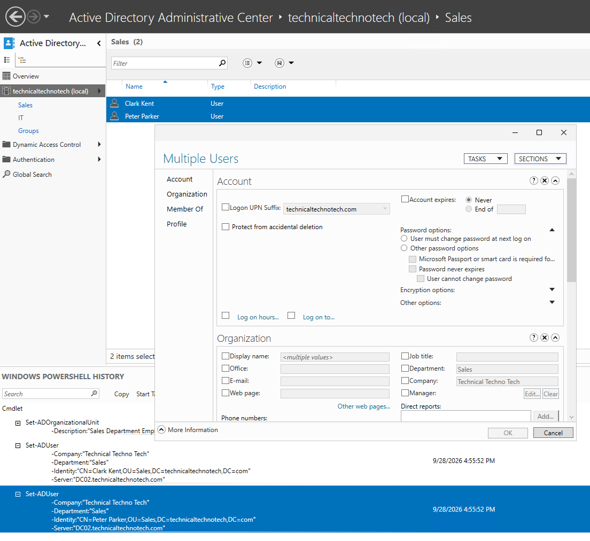
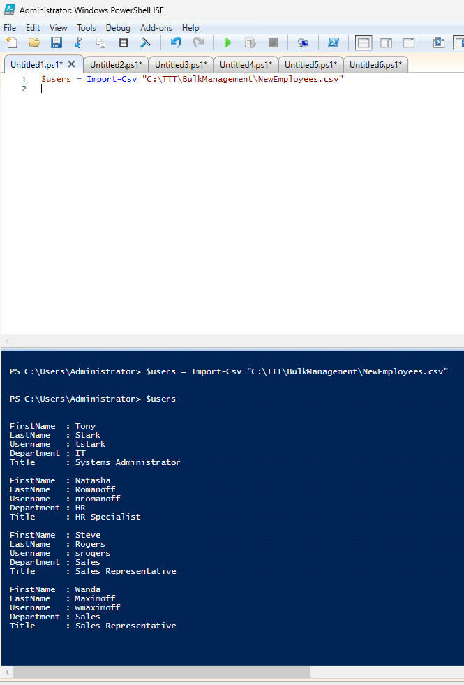
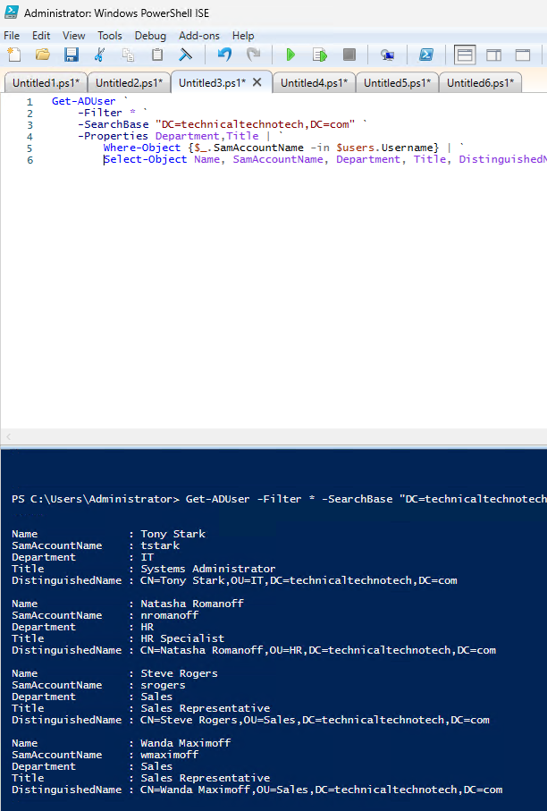
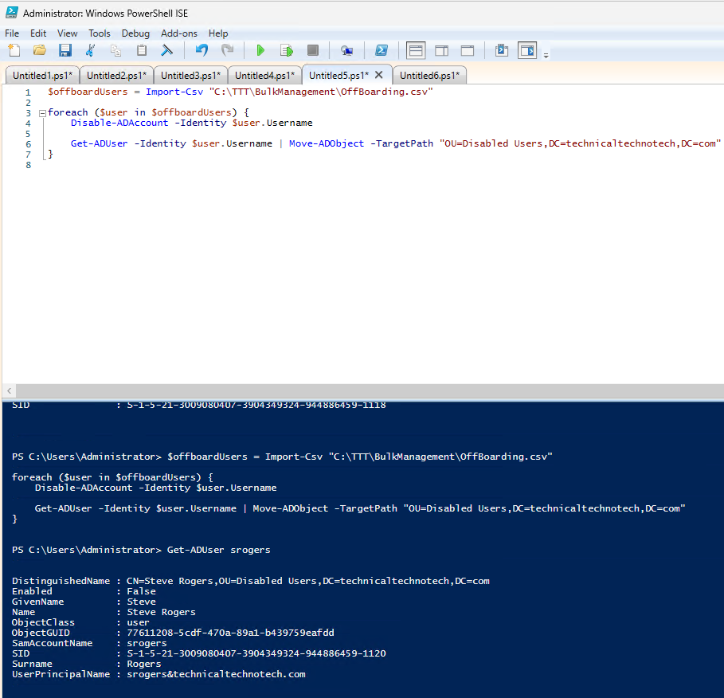

# AD DS Bulk User Management with ADAC and PowerShell

## Project Overview

This project demonstrates how Active Directory Domain Services (AD DS) administrators can manage multiple user accounts efficiently using **Active Directory Administrative Center (ADAC)** and **PowerShell**.

The project covers:

- Bulk editing existing users with ADAC
- Viewing PowerShell commands generated by ADAC
- Importing employee information from CSV files
- Creating multiple AD users with PowerShell
- Automatically placing users into departmental OUs
- Automatically assigning users to security groups
- Using conditional logic with `switch`
- Bulk disabling and moving accounts during offboarding
- Exporting AD user information to CSV for auditing

The goal was to move beyond managing AD objects individually and practice scalable administrative workflows.

---

## Lab Environment

| System | Purpose |
|---|---|
| DC01 | Writable Domain Controller |
| DC02 | Writable Domain Controller / File Server |
| MGMT01 | Administrative Management Workstation |
| CLIENT01 | Domain-Joined Windows Client |

**Domain:** `technicaltechnotech.com`  
**NetBIOS Name:** `TTT`

Administration was primarily performed from **MGMT01** using RSAT, ADAC, and PowerShell.

---

# Part 1 — Bulk Editing Users with ADAC

Active Directory Administrative Center allows administrators to select multiple objects and modify supported attributes simultaneously.

Existing Sales users were selected:

- Peter Parker
- Clark Kent

The following attributes were updated for both accounts:

```text
Department: Sales
Company: Technical Techno Tech
```

The changes were verified with PowerShell:

```powershell
Get-ADUser -Filter * `
    -SearchBase "OU=Sales,DC=technicaltechnotech,DC=com" `
    -Properties Department,Company |
    Select-Object Name,Department,Company
```

### Key Concept

The `-Properties` parameter requests additional AD attributes that are not included in the default `Get-ADUser` output.

For example:

```powershell
-Properties Department,Company
```

means:

> Retrieve the Department and Company attributes in addition to the default user properties.

---

# Part 2 — ADAC PowerShell History

After performing the bulk edit through ADAC, I opened **Windows PowerShell History**.

ADAC showed that the graphical actions were translated into PowerShell commands using `Set-ADUser`.



This demonstrated that graphical AD administration tools often execute underlying administrative operations that can also be performed directly with PowerShell.

### PowerShell Command Structure

Example:

```powershell
Set-ADUser -Identity "pparker" -Department "Sales"
```

Where:

- `Set-ADUser` = cmdlet
- `-Identity` = specifies the AD user
- `-Department` = specifies the attribute being changed
- `"Sales"` = new value

---

# Part 3 — Creating the Bulk Management Workspace

A project directory was created on MGMT01:

```text
C:\TTT\BulkManagement
```

A CSV file was then created:

```text
C:\TTT\BulkManagement\NewEmployees.csv
```

The employee data contained:

```csv
FirstName,LastName,Username,Department,Title
Tony,Stark,tstark,IT,Systems Administrator
Natasha,Romanoff,nromanoff,HR,HR Specialist
Steve,Rogers,srogers,Sales,Sales Representative
Wanda,Maximoff,wmaximoff,Sales,Sales Representative
```

This simulated receiving structured employee information that needed to be entered into Active Directory.

---

# Part 4 — Importing CSV Data into PowerShell

The CSV was imported using:

```powershell
$users = Import-Csv "C:\TTT\BulkManagement\NewEmployees.csv"
```



`Import-Csv` converts each CSV row into a PowerShell object.

For example:

```csv
Tony,Stark,tstark,IT,Systems Administrator
```

becomes an object containing properties similar to:

```text
FirstName  = Tony
LastName   = Stark
Username   = tstark
Department = IT
Title      = Systems Administrator
```

Individual properties can then be accessed:

```powershell
$users[0].FirstName
```

Result:

```text
Tony
```

### Memory Concept

```text
CSV row    → PowerShell object
CSV column → PowerShell property
```

---

# Part 5 — Processing Multiple Users with `foreach`

Before modifying Active Directory, the imported information was tested using a `foreach` loop.

```powershell
foreach ($user in $users) {

    Write-Host "Employee: $($user.FirstName) $($user.LastName)"
    Write-Host "Username: $($user.Username)"
    Write-Host "Department: $($user.Department)"
    Write-Host "-----------------------------"

}
```

The loop processes each employee individually.

Conceptually:

```text
$users
   |
   +-- Tony
   |
   +-- Natasha
   |
   +-- Steve
   |
   +-- Wanda
```

During each iteration:

```powershell
$user
```

represents the current employee.

This is similar to iterating through an array of objects in other programming languages.

---

# Part 6 — Bulk Creating AD Users

A temporary password was entered securely:

```powershell
$password = Read-Host "Enter temporary password" -AsSecureString
```

This prevented the password from being stored directly in the CSV or script.

The OU path was dynamically constructed from each employee's department:

```powershell
$ouPath = "OU=$($user.Department),DC=technicaltechnotech,DC=com"
```

For example:

```text
Department = IT
```

produces:

```text
OU=IT,DC=technicaltechnotech,DC=com
```

The users were then created:

```powershell
$password = Read-Host "Enter temporary password" -AsSecureString

foreach ($user in $users) {

    $ouPath = "OU=$($user.Department),DC=technicaltechnotech,DC=com"

    New-ADUser `
        -Name "$($user.FirstName) $($user.LastName)" `
        -GivenName $user.FirstName `
        -Surname $user.LastName `
        -SamAccountName $user.Username `
        -UserPrincipalName "$($user.Username)@technicaltechnotech.com" `
        -Department $user.Department `
        -Title $user.Title `
        -Path $ouPath `
        -AccountPassword $password `
        -Enabled $true `
        -ChangePasswordAtLogon $true
}
```
---

# Part 7 — Verifying Bulk User Creation

The newly created users were verified with:

```powershell
Get-ADUser -Filter * `
    -SearchBase "DC=technicaltechnotech,DC=com" `
    -Properties Department,Title |
    Where-Object {
        $_.SamAccountName -in $users.Username
    } |
    Select-Object Name,SamAccountName,Department,Title,DistinguishedName
```


### Understanding `$_`

Inside a PowerShell pipeline:

```powershell
$_
```

represents the **current object being processed**.

For example:

```powershell
Where-Object {
    $_.SamAccountName -in $users.Username
}
```

checks the `SamAccountName` property of each AD user passing through the pipeline.

---

# Part 8 — Automatically Assigning Department Groups

The new employees also needed the correct departmental security groups.

Existing groups included:

```text
GG_IT
GG_HR
GG_Sales
```

The desired mapping was:

```text
IT    → GG_IT
HR    → GG_HR
Sales → GG_Sales
```

A PowerShell `switch` statement was used:

```powershell
foreach ($user in $users) {

    switch ($user.Department) {

        "IT" {
            $group = "GG_IT"
        }

        "HR" {
            $group = "GG_HR"
        }

        "Sales" {
            $group = "GG_Sales"
        }

    }

    Add-ADGroupMember `
        -Identity $group `
        -Members $user.Username
}
```

### Understanding `switch`

A `switch` statement performs different actions depending on a value.

```text
Department
     |
   switch
     |
 +---+---+
 |   |   |
 IT  HR Sales
 |   |   |
 v   v   v
GG  GG  GG
IT  HR  Sales
```

---

# Part 9 — Connecting Bulk Management to AGDLP

The departmental Global groups had already been incorporated into an AGDLP permissions design.

For example:

```text
Tony Stark
    |
    v
GG_IT
    |
    v
DL_IT_Share_Modify
    |
    v
NTFS Modify Permission
    |
    v
IT Department Folder
```

Because resource permissions were assigned through groups rather than directly to individual users, onboarding Tony only required adding him to `GG_IT`.

He could then receive the resource permissions associated with the IT role.

### AGDLP

```text
A → G → DL → P
```

Meaning:

```text
Accounts
   ↓
Global Groups
   ↓
Domain Local Groups
   ↓
Permissions
```

This demonstrates how proper group design simplifies user onboarding and access management.

---

# Part 10 — Bulk Offboarding

A second CSV file was created:

```text
C:\TTT\BulkManagement\Offboarding.csv
```

Contents:

```csv
Username
srogers
wmaximoff
```

The CSV was imported:

```powershell
$offboardUsers = Import-Csv "C:\TTT\BulkManagement\Offboarding.csv"
```

A dedicated OU was used for disabled accounts:

```text
OU=Disabled Users,DC=technicaltechnotech,DC=com
```

If needed, the OU could be created with:

```powershell
New-ADOrganizationalUnit `
    -Name "Disabled Users" `
    -Path "DC=technicaltechnotech,DC=com" `
    -ProtectedFromAccidentalDeletion $true
```

The accounts were disabled and moved:

```powershell
foreach ($user in $offboardUsers) {

    Disable-ADAccount -Identity $user.Username

    Get-ADUser -Identity $user.Username |
        Move-ADObject `
            -TargetPath "OU=Disabled Users,DC=technicaltechnotech,DC=com"
}
```

This resulted in:

```text
Steve Rogers
    |
    +-- Account disabled
    |
    +-- Moved to Disabled Users OU

Wanda Maximoff
    |
    +-- Account disabled
    |
    +-- Moved to Disabled Users OU
```

The results were verified with:

```powershell
Get-ADUser srogers -Properties Enabled |
    Select-Object Name,Enabled,DistinguishedName

Get-ADUser wmaximoff -Properties Enabled |
    Select-Object Name,Enabled,DistinguishedName
```



---

# Part 11 — Exporting an AD User Audit

The final task was to export Active Directory user information into a CSV report.

```powershell
Get-ADUser -Filter * `
    -Properties Department,Title,Company,Enabled |
    Select-Object `
        Name,
        SamAccountName,
        Department,
        Title,
        Company,
        Enabled,
        DistinguishedName |
    Export-Csv `
        "C:\TTT\BulkManagement\ADUserAudit.csv" `
        -NoTypeInformation
```

The resulting report was saved as:

```text
C:\TTT\BulkManagement\ADUserAudit.csv
```

This demonstrated both directions of CSV-based administration:

```text
Import-Csv

CSV
 ↓
PowerShell Objects
 ↓
Active Directory
```

and:

```text
Export-Csv

Active Directory
 ↓
PowerShell Objects
 ↓
CSV Report
```

---

# PowerShell Line Continuation

Long PowerShell commands were formatted across multiple lines using the backtick:

```powershell
`
```

For example:

```powershell
Get-ADUser -Filter * `
    -Properties Department,Title,Company,Enabled
```

This is equivalent to:

```powershell
Get-ADUser -Filter * -Properties Department,Title,Company,Enabled
```

When a backtick appears at the end of the line, PowerShell continues reading the command on the next line.

---

# Administrative Workflow

The completed project demonstrated the following workflow:

```text
Employee Information
        |
        v
      CSV
        |
        v
   Import-Csv
        |
        v
     foreach
        |
        v
   New-ADUser
        |
        +-------------------+
        |                   |
        v                   v
Correct Department OU   Department Attribute
        |
        v
 Department Global Group
        |
        v
      AGDLP
        |
        v
 Resource Permissions
```

The lifecycle continued with:

```text
Employee Departure
        |
        v
Offboarding CSV
        |
        v
Disable-ADAccount
        |
        v
Move-ADObject
        |
        v
Disabled Users OU
```

Finally:

```text
Active Directory
        |
        v
   Get-ADUser
        |
        v
  Select-Object
        |
        v
   Export-Csv
        |
        v
ADUserAudit.csv
```

---

# Key PowerShell Cmdlets Used

| Cmdlet | Purpose |
|---|---|
| `Import-Csv` | Convert CSV rows into PowerShell objects |
| `Get-ADUser` | Retrieve AD user accounts |
| `Set-ADUser` | Modify AD user attributes |
| `New-ADUser` | Create AD user accounts |
| `Add-ADGroupMember` | Add users to AD groups |
| `Disable-ADAccount` | Disable an AD account |
| `Move-ADObject` | Move an AD object between containers/OUs |
| `New-ADOrganizationalUnit` | Create an OU |
| `Select-Object` | Select properties for output |
| `Where-Object` | Filter objects in the pipeline |
| `Export-Csv` | Export PowerShell objects to CSV |

---

# What I Learned

- How to perform bulk user changes with Active Directory Administrative Center.
- How ADAC actions can be viewed through PowerShell History.
- How `Import-Csv` converts structured CSV data into PowerShell objects.
- How CSV columns become object properties.
- How to access object properties such as `$user.Department`.
- How to process multiple objects with `foreach`.
- How to create multiple Active Directory users with `New-ADUser`.
- How to dynamically construct an OU distinguished name.
- How to use `switch` for conditional logic.
- How to automatically assign users to groups based on department.
- How bulk onboarding integrates with an AGDLP permissions model.
- How to disable and move multiple accounts during offboarding.
- How to export Active Directory information for auditing.
- How `$_` represents the current pipeline object.
- How PowerShell backticks can continue long commands onto another line.
- Why passwords should not be stored in plaintext CSV files or scripts.

---

# Skills Practiced

- Active Directory Domain Services
- Active Directory Administrative Center
- Active Directory Users and Computers
- PowerShell
- PowerShell ActiveDirectory Module
- Bulk User Administration
- CSV Data Management
- User Provisioning
- User Offboarding
- Organizational Unit Management
- AD Attribute Management
- Security Group Management
- AGDLP
- NTFS Access Management Concepts
- PowerShell Objects
- PowerShell Pipelines
- `foreach` Loops
- Conditional Logic
- `switch` Statements
- Distinguished Names
- AD Reporting and Auditing
- Administrative Automation

---

# Project Summary

This project demonstrated how Active Directory administration can scale from GUI-based management to PowerShell automation.

Instead of manually creating and configuring each employee individually, structured employee information was imported from CSV and processed through PowerShell.

The project covered the user lifecycle from:

```text
Bulk Onboarding
      ↓
OU Placement
      ↓
Attribute Configuration
      ↓
Group Membership
      ↓
AGDLP Resource Access
      ↓
Bulk Offboarding
      ↓
Audit / Reporting
```

This provides a foundation for automating larger Active Directory user-management workflows in a Windows Server environment.
