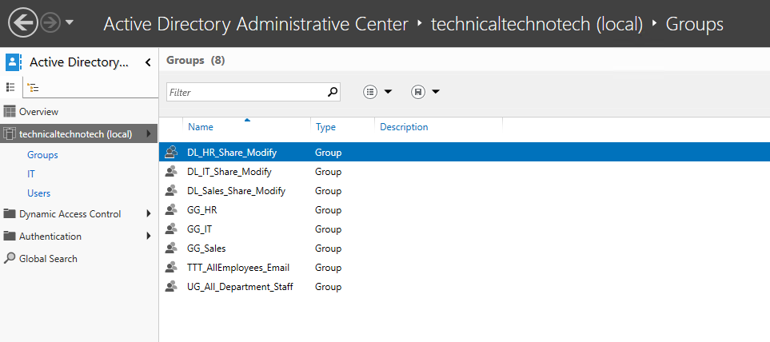
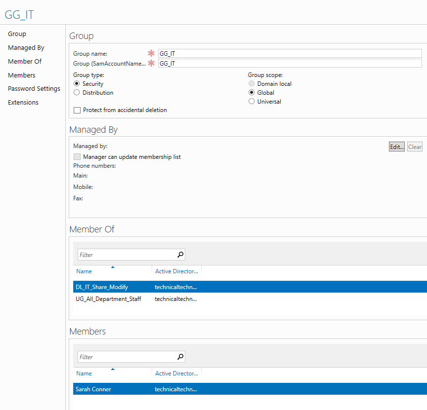
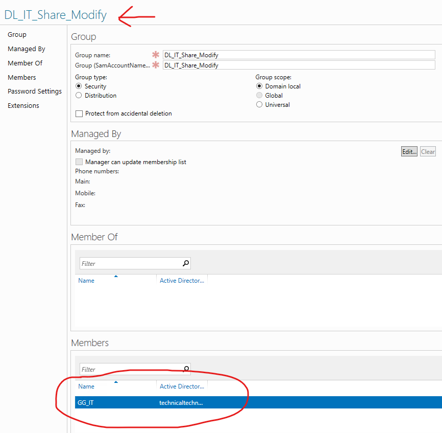
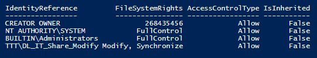
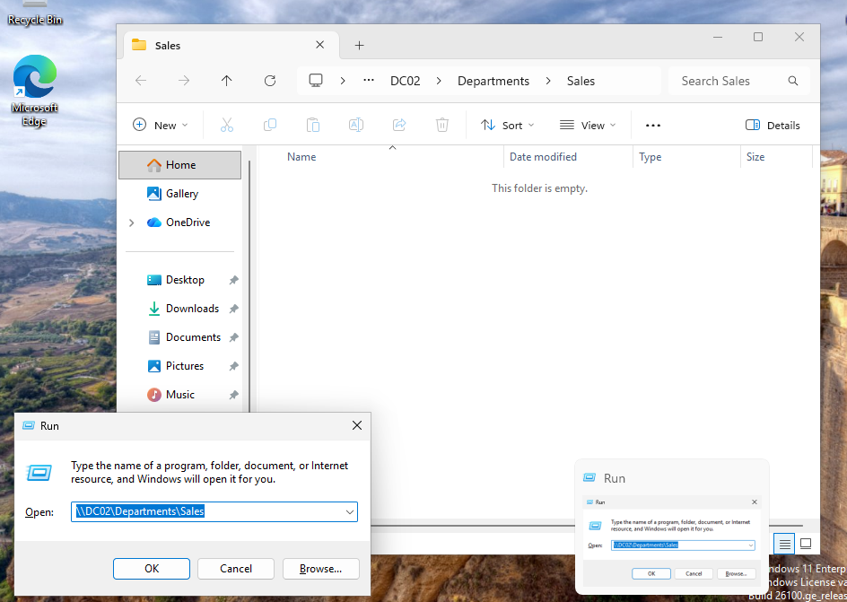
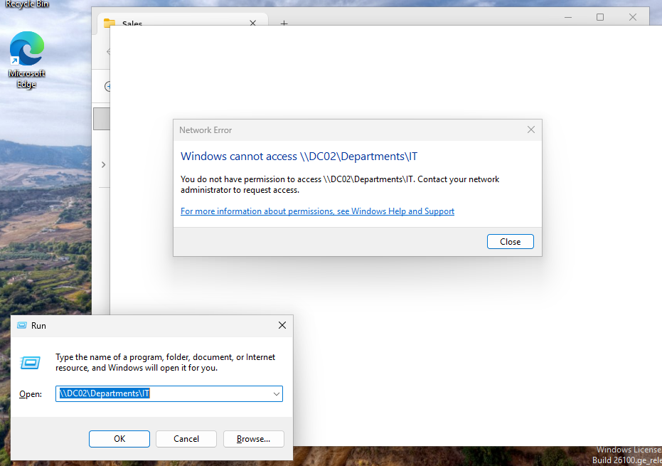

# Active Directory Groups, AGDLP & Department File Access

## Project Overview

This project demonstrates how **Active Directory Domain Services (AD DS) groups** can be used to organize users and control access to network resources.

I configured and tested:

- Security groups
- Distribution groups
- Global group scope
- Domain Local group scope
- Universal group scope
- Group nesting
- AGDLP
- SMB file sharing
- NTFS permissions
- NTFS inheritance
- Cross-department access control

The primary goal was to implement **role-based access to departmental file shares** without assigning permissions directly to individual users.

***

## Lab Environment

**Domain:** `technicaltechnotech.com`  
**NetBIOS Domain Name:** `TTT`

### Systems

- **DC01** — Windows Server Domain Controller
- **DC02** — Windows Server Core Domain Controller / Lab File Server
- **MGMT01** — Windows Management Workstation
- **Windows Client VM** — Used for employee access testing

> **Note:** DC02 was used as the file server for this lab because it was already available. In a production environment, a dedicated member file server would generally be preferred instead of hosting departmental file shares on a domain controller.

### Technologies Used

- Active Directory Domain Services
- Active Directory Administrative Center (ADAC)
- Windows Server Core
- Windows PowerShell
- PowerShell ISE
- PowerShell Remoting
- SMB File Sharing
- NTFS Permissions
- Windows File Explorer

***

# Scenario

Technical Techno Tech needed centralized departmental folders for:

- IT
- HR
- Sales

Employees should be able to modify files belonging to their own department but should not have access to another department's protected files.

Instead of assigning permissions directly to individual users, I implemented the **AGDLP model**.

```text
A → G → DL → P

Accounts
   ↓
Global Groups
   ↓
Domain Local Groups
   ↓
Permissions
```

This separates employee organization from resource permissions.

***

# Active Directory Group Structure

I created a dedicated `Groups` OU to organize the groups used throughout the project.

```text
technicaltechnotech.com
│
└── Groups
    │
    ├── GG_IT
    ├── GG_HR
    ├── GG_Sales
    │
    ├── DL_IT_Share_Modify
    ├── DL_HR_Share_Modify
    ├── DL_Sales_Share_Modify
    │
    ├── UG_All_Department_Staff
    │
    └── TTT_AllEmployees_Email
```

### Screenshot



***

# Group Types

Active Directory supports two primary group types:

| Group Type | Purpose |
|---|---|
| **Security** | Used for permissions and authorization |
| **Distribution** | Used primarily for email distribution |

The departmental access groups in this project were configured as **Security groups** because they needed to participate in Windows authorization.

***

# Global Security Groups

I created one Global Security group for each department:

```text
GG_IT
GG_HR
GG_Sales
```

The Global groups represent **who the users are or what role they belong to**.

Department employees were added to their appropriate Global groups.

```text
GG_IT
└── Sarah Connor

GG_HR
└── Diana Prince

GG_Sales
├── Peter Parker
└── Clark Kent
```

For example:

```text
Sarah Connor
     ↓
GG_IT
```

This identifies Sarah as an IT employee but does not directly give Sarah access to an IT resource.

### Screenshot



***

# Domain Local Security Groups

I created Domain Local Security groups representing access to each departmental resource:

```text
DL_IT_Share_Modify
DL_HR_Share_Modify
DL_Sales_Share_Modify
```

Instead of adding users directly to these groups, I nested the corresponding Global groups inside them.

```text
DL_IT_Share_Modify
└── GG_IT

DL_HR_Share_Modify
└── GG_HR

DL_Sales_Share_Modify
└── GG_Sales
```

This created the core AGDLP relationship.

```text
Sarah Connor
     ↓
GG_IT
     ↓
DL_IT_Share_Modify
     ↓
NTFS Modify
```

### Screenshot



***

# Understanding AGDLP

AGDLP stands for:

```text
A = Accounts
G = Global Groups
DL = Domain Local Groups
P = Permissions
```

The model used in this project was:

```text
Accounts
   ↓
Represent individual employees

Global Groups
   ↓
Represent roles or departments

Domain Local Groups
   ↓
Represent access to resources

Permissions
   ↓
Applied to the resource
```

For example:

```text
Sarah Connor
     │
     ▼
GG_IT
     │
     ▼
DL_IT_Share_Modify
     │
     ▼
NTFS Modify
     │
     ▼
IT Department Folder
```

This allows access to be managed through group membership rather than modifying folder permissions every time an employee joins or leaves a department.

***

# Creating the Department File Structure

On DC02, I created:

```text
C:\Departments
│
├── IT
├── HR
└── Sales
```

PowerShell Remoting was used from MGMT01 because DC02 was running Windows Server Core.

Example:

```powershell
Invoke-Command -ComputerName DC02 -ScriptBlock {
    New-Item -Path "C:\Departments" -ItemType Directory -Force
    New-Item -Path "C:\Departments\IT" -ItemType Directory -Force
    New-Item -Path "C:\Departments\HR" -ItemType Directory -Force
    New-Item -Path "C:\Departments\Sales" -ItemType Directory -Force
}
```

***

# Creating the SMB Share

The parent `Departments` folder was shared through SMB.

```text
\\DC02\Departments
```

The SMB share was created remotely with PowerShell.

```powershell
Invoke-Command -ComputerName DC02 -ScriptBlock {
    New-SmbShare `
        -Name "Departments" `
        -Path "C:\Departments" `
        -ChangeAccess "TTT\Domain Users"
}
```

The SMB layer allowed domain users to connect to the share.

Individual departmental access was then controlled through **NTFS permissions**.

***

# SMB vs NTFS Permissions

This project reinforced the difference between the two permission layers.

```text
SMB Share Permission
        ↓
Controls access through the network share

NTFS Permission
        ↓
Controls access to files and folders
```

For this lab:

```text
\\DC02\Departments
        │
        │ SMB
        ▼
+----------------------+
| Departments          |
|                      |
| IT    ← NTFS ACL     |
| HR    ← NTFS ACL     |
| Sales ← NTFS ACL     |
+----------------------+
```

The SMB share provided network access while NTFS permissions provided the detailed departmental authorization.

***

# Configuring NTFS Permissions

Each Domain Local group received **Modify** permission on its corresponding folder.

```text
DL_IT_Share_Modify
        ↓
NTFS Modify
        ↓
C:\Departments\IT


DL_HR_Share_Modify
        ↓
NTFS Modify
        ↓
C:\Departments\HR


DL_Sales_Share_Modify
        ↓
NTFS Modify
        ↓
C:\Departments\Sales
```

An example PowerShell configuration used during the project was:

```powershell
$acl = Get-Acl "C:\Departments\IT"

$rule = New-Object System.Security.AccessControl.FileSystemAccessRule(
    "TTT\DL_IT_Share_Modify",
    "Modify",
    "ContainerInherit,ObjectInherit",
    "None",
    "Allow"
)

$acl.AddAccessRule($rule)

Set-Acl "C:\Departments\IT" $acl
```

This gave the Domain Local group Modify permission without assigning NTFS permissions directly to Sarah Connor.

***

# Testing the Initial Configuration

I first logged into a domain-joined Windows client as:

```text
TTT\sconnor
```

Sarah successfully accessed:

```text
\\DC02\Departments\IT
```

She was able to:

- Open the folder
- Create files
- Edit files
- Save changes
- Delete files

This confirmed that the positive AGDLP access path was functioning.

```text
Sarah
 ↓
GG_IT
 ↓
DL_IT_Share_Modify
 ↓
Modify
 ↓
ACCESS ALLOWED
```

***

# Discovering an NTFS Inheritance Issue

I then logged in as Diana Prince:

```text
TTT\dprince
```

Diana was not a member of the IT groups.

Expected:

```text
Diana
 ↓
GG_HR
 ↓
No IT group membership
 ↓
ACCESS DENIED
```

However, Diana was initially able to create, modify, and delete files inside the IT folder.

This indicated another permission path existed.

***

# Investigating the ACL

I inspected the IT folder's Access Control List using PowerShell:

```powershell
Invoke-Command -ComputerName DC02 -ScriptBlock {

    (Get-Acl "C:\Departments\IT").Access |
        Select-Object IdentityReference, FileSystemRights, AccessControlType, IsInherited |
        Format-Table -AutoSize
}
```

The results showed an inherited:

```text
BUILTIN\Users
```

permission.

This demonstrated an important authorization concept:

> A user does not need to receive access through the intended group if another applicable group already grants access.

In other words:

```text
Not being granted access by one group
                ≠
           Explicit Deny
```

Windows evaluates the applicable permissions from the user's security principals.

***

# Disabling NTFS Inheritance

I disabled inheritance on the IT departmental folder while preserving the existing inherited permissions as explicit permissions.

```powershell
$acl = Get-Acl "C:\Departments\IT"

$acl.SetAccessRuleProtection($true, $true)

Set-Acl "C:\Departments\IT" $acl
```

The first `$true` disables inheritance.

The second `$true` preserves the currently inherited rules by converting them into explicit permissions.

***

# Removing Broad User Access

After disabling inheritance, I removed the `BUILTIN\Users` permission from the departmental folder.

```powershell
$acl = Get-Acl "C:\Departments\IT"

$rules = $acl.Access | Where-Object {
    $_.IdentityReference -eq "BUILTIN\Users"
}

foreach ($rule in $rules) {
    $acl.RemoveAccessRuleSpecific($rule)
}

Set-Acl "C:\Departments\IT" $acl
```

Important system and administrative permissions were preserved.

The resulting design was:

```text
SYSTEM
    ↓
Full Control

Administrators
    ↓
Full Control

DL_IT_Share_Modify
    ↓
Modify

BUILTIN\Users
    ↓
Removed
```

The same configuration model was then applied to the HR and Sales folders.

### Screenshot



***

# Understanding `$_` in PowerShell

The project also introduced the PowerShell automatic variable:

```powershell
$_
```

Inside a pipeline operation such as:

```powershell
$acl.Access | Where-Object {
    $_.IdentityReference -eq "BUILTIN\Users"
}
```

`$_` represents the **current object being processed**.

Conceptually:

```text
$acl.Access
     ↓
Each ACL rule
     ↓
$_
```

This is similar to a callback parameter in JavaScript:

```javascript
acl.access.filter(rule => {
    return rule.identityReference === "BUILTIN\\Users";
});
```

In the PowerShell example:

```powershell
$_.IdentityReference
```

means:

> Examine the `IdentityReference` property of the current ACL rule.

***

# Cross-Department Access Testing

After correcting the NTFS inheritance configuration, I performed another series of tests.

The expected authorization matrix was:

| User | IT | HR | Sales |
|---|---|---|---|
| Sarah Connor | Modify | Denied | Denied |
| Diana Prince | Denied | Modify | Denied |
| Peter Parker | Denied | Denied | Modify |
| Clark Kent | Denied | Denied | Modify |

Sarah was able to access the IT folder while Diana was denied access.

This confirmed that access was now being controlled through the intended group structure.

### Successful Access

```text
Sarah
 ↓
GG_IT
 ↓
DL_IT_Share_Modify
 ↓
NTFS Modify
 ↓
ACCESS ALLOWED
```

### Unauthorized Access

```text
Diana
 ↓
GG_HR
 ↓
No IT resource group
 ↓
No applicable IT permission
 ↓
ACCESS DENIED
```

### Screenshots





***

# Security vs Distribution Groups

To explore Active Directory group types, I also created:

```text
TTT_AllEmployees_Email
```

Configuration:

```text
Group Type:  Distribution
Group Scope: Universal
```

The group represented an organization-wide email distribution list.

Unlike a Security group, a Distribution group is not security-enabled and therefore is not intended to grant NTFS permissions.

```text
Security Group
      ↓
Security Principal
      ↓
Authorization
      ↓
NTFS Permissions


Distribution Group
      ↓
Email Distribution
      ↓
Not used for NTFS authorization
```

I tested this by attempting to select the Distribution group when assigning NTFS permissions.

Windows did not resolve the group as an appropriate security principal for the NTFS ACL.

This provided a practical demonstration of the difference between the two group types.

***

# Universal Group Scope

I also created:

```text
UG_All_Department_Staff
```

Configuration:

```text
Group Type:  Security
Group Scope: Universal
```

The departmental Global groups were nested inside:

```text
UG_All_Department_Staff
│
├── GG_IT
├── GG_HR
└── GG_Sales
```

This demonstrated how Universal groups can be used as an additional grouping layer.

Universal groups become more useful in environments containing multiple Active Directory domains.

For example:

```text
GG_Texas_IT
      \
       \
        UG_All_IT
       /
      /
GG_California_IT
```

This can extend AGDLP into:

```text
A → G → U → DL → P
```

or:

```text
AGUDLP

Accounts
   ↓
Global Groups
   ↓
Universal Groups
   ↓
Domain Local Groups
   ↓
Permissions
```

Because my current lab contains only one domain, the simpler **AGDLP** model was sufficient for the actual departmental permissions.

***

# Local Groups vs Domain Local Groups

This project also reinforced the difference between **Local groups** and the Active Directory **Domain Local** scope.

A Local group belongs to an individual Windows computer.

Examples include:

```text
CLIENT01\Administrators
CLIENT01\Users
CLIENT01\Remote Desktop Users
```

A Domain Local group exists within Active Directory and is commonly used to assign permissions to resources within its domain.

```text
Local Group
     ↓
Individual computer


Domain Local Group
     ↓
Active Directory domain resources
```

For example, adding:

```text
TTT\GG_IT
```

to:

```text
CLIENT01\Administrators
```

could make the members of `GG_IT` local administrators on CLIENT01 without automatically making them administrators on every other computer.

***

# Group Types and Scopes Summary

## Group Types

| Type | Primary Purpose |
|---|---|
| **Security** | Permissions and authorization |
| **Distribution** | Email distribution |

## Active Directory Group Scopes

| Scope | Typical Purpose |
|---|---|
| **Global** | Organize users/accounts by role |
| **Universal** | Combine groups across domains |
| **Domain Local** | Assign access to resources |

## Memory Model

```text
TYPE
│
├── Security     → Permissions
└── Distribution → Email


SCOPE
│
├── Global       → Organize users/roles
├── Universal    → Combine across domains
└── Domain Local → Resource permissions
```

***

# Final Architecture

The completed departmental access model was:

```text
ACTIVE DIRECTORY

Sarah Connor
     ↓
GG_IT
     ↓
DL_IT_Share_Modify ─────────────┐
                                │
Diana Prince                    │
     ↓                          │
GG_HR                           │
     ↓                          │
DL_HR_Share_Modify ─────────┐   │
                            │   │
Peter Parker                │   │
Clark Kent                  │   │
     ↓                      │   │
GG_Sales                    │   │
     ↓                      │   │
DL_Sales_Share_Modify ──┐   │   │
                        │   │   │
                        ▼   ▼   ▼

                   DC02 FILE SHARE

                  \\DC02\Departments
                         │
              ┌──────────┼──────────┐
              ▼          ▼          ▼
             IT          HR        Sales
              ▲          ▲          ▲
              │          │          │
            Modify     Modify     Modify
```

***

# What I Learned

- Created and managed Active Directory groups using ADAC
- Learned the difference between Security and Distribution groups
- Worked with Global, Domain Local, and Universal group scopes
- Learned the difference between Local and Domain Local groups
- Implemented the AGDLP permission model
- Practiced nested group membership
- Learned why users should generally not receive resource permissions directly
- Created departmental folders on Windows Server Core
- Created and managed an SMB share
- Configured NTFS permissions
- Learned the difference between SMB Share permissions and NTFS permissions
- Investigated inherited NTFS permissions
- Disabled NTFS inheritance while preserving required ACL entries
- Removed broad user access from protected departmental folders
- Tested authorized and unauthorized access
- Performed cross-department access testing
- Learned how Windows security tokens relate to group membership
- Learned why signing out and back in may be required after group membership changes
- Used PowerShell to inspect and modify ACLs
- Learned how the PowerShell `$_` automatic variable works
- Practiced troubleshooting an unexpected permissions result rather than assuming the initial configuration was correct

***

# Skills Practiced

- Active Directory Domain Services (AD DS)
- Active Directory Administrative Center (ADAC)
- Active Directory Security Groups
- Active Directory Distribution Groups
- Global Groups
- Domain Local Groups
- Universal Groups
- Local Groups
- Group Nesting
- AGDLP
- AGUDLP
- Role-Based Access Control
- Principle of Least Privilege
- Windows Server Core
- PowerShell Remoting
- SMB File Sharing
- NTFS Permissions
- Access Control Lists (ACLs)
- NTFS Inheritance
- Windows Authorization
- Security Tokens
- Cross-Department Access Testing
- `Get-Acl`
- `Set-Acl`
- `Where-Object`
- `$_`
- `Invoke-Command`
- `New-SmbShare`

***

# Project Outcome

The project successfully implemented group-based departmental access using the **AGDLP model**.

Instead of assigning permissions directly to individual employees, users were placed into Global groups based on their department. Those Global groups were nested into Domain Local groups representing resource access, and the Domain Local groups were assigned NTFS permissions.

```text
Account
   ↓
Global Group
   ↓
Domain Local Group
   ↓
Permission
```

Testing confirmed that authorized employees could modify their departmental resources while users from other departments were denied access.

The project also demonstrated how incorrectly inherited NTFS permissions can bypass an intended group-access design and how ACL inspection and inheritance management can be used to troubleshoot and correct the issue.
