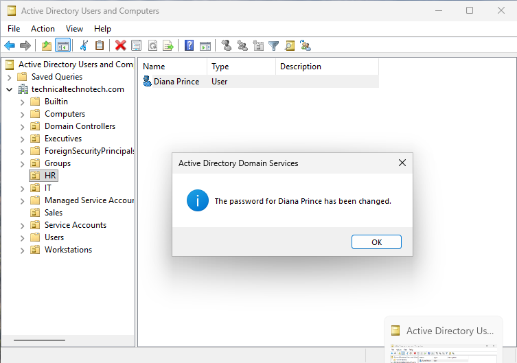
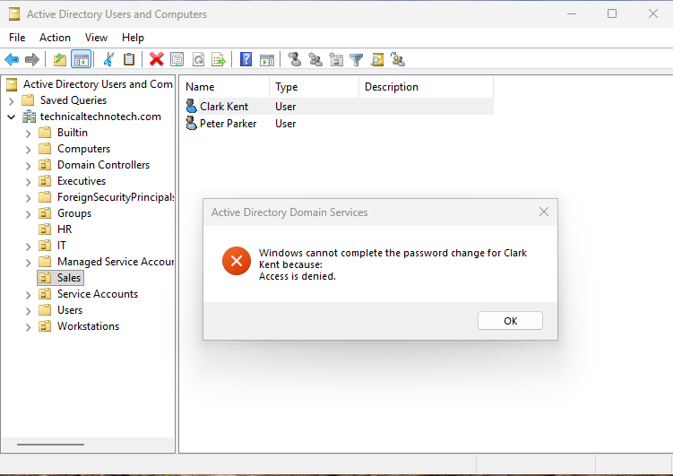
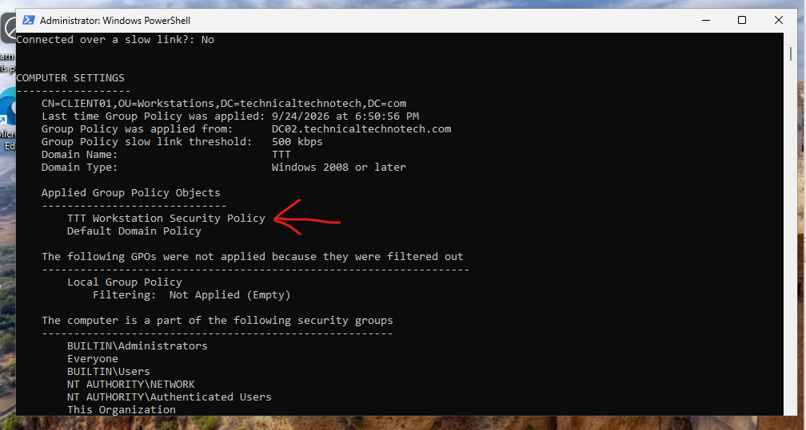
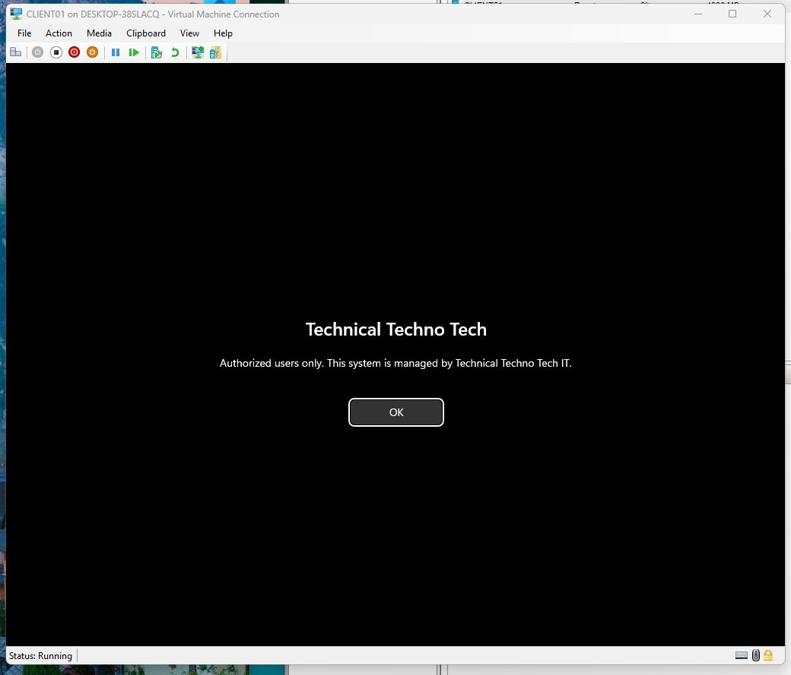

# Active Directory OU Design, Delegation & Group Policy

## Project Overview

This project demonstrates how **Active Directory Organizational Units (OUs)** can be used to organize domain objects, delegate administrative responsibilities, and target computers with Group Policy.

The project focused on:

- Organizational Units
- Generic Active Directory containers
- `CN=` vs `OU=`
- Default `Computers` container
- Computer object organization
- Redirecting new computer accounts
- Delegation of Control
- Least-privilege administration
- OU-level management
- COM+ partitions
- Group Policy Objects
- Computer Configuration policies
- Group Policy verification with `gpresult`

The primary goal was to restructure the Technical Techno Tech domain so workstation objects could be managed more effectively while allowing limited administrative responsibilities to be delegated without granting Domain Admin privileges.

***

# Lab Environment

**Domain:** `technicaltechnotech.com`  
**NetBIOS Domain Name:** `TTT`

## Systems

- **DC01** — Windows Server Domain Controller
- **DC02** — Windows Server Core Domain Controller
- **MGMT01** — Windows Management Workstation
- **CLIENT01** — Domain-joined Windows client used for testing

## Technologies Used

- Active Directory Domain Services (AD DS)
- Active Directory Users and Computers (ADUC)
- Active Directory Administrative Center (ADAC)
- Group Policy Management
- Windows PowerShell
- RSAT
- Hyper-V
- `redircmp`
- `gpupdate`
- `gpresult`

***

# Scenario

Technical Techno Tech has grown and needs a more structured Active Directory environment.

The existing environment relied partly on built-in Active Directory containers such as:

```text
CN=Computers
CN=Users
```

The goal was to improve the environment by:

1. Understanding the difference between containers and OUs
2. Creating a dedicated Workstations OU
3. Moving workstation computer objects into the OU
4. Redirecting future computer accounts into the Workstations OU
5. Delegating limited administrative responsibilities
6. Testing allowed and denied administrative actions
7. Examining generic containers and COM+ partitions
8. Linking a workstation-specific GPO
9. Verifying that the GPO applied successfully

***

# Initial Active Directory Structure

The domain already contained several built-in containers and custom Organizational Units.

```text
technicaltechnotech.com
│
├── Builtin
├── Computers
├── Domain Controllers
├── ForeignSecurityPrincipals
├── Managed Service Accounts
├── Users
│
├── Executives
├── Groups
├── HR
├── IT
├── Sales
└── Service Accounts
```

Although many of these objects appear similar to folders inside ADUC, they are not necessarily the same type of Active Directory object.

***

# Containers vs Organizational Units

One of the first goals of the project was understanding the difference between a generic Active Directory container and an Organizational Unit.

For example:

```text
CN=Computers,DC=technicaltechnotech,DC=com
```

is different from:

```text
OU=IT,DC=technicaltechnotech,DC=com
```

The prefixes identify the objects differently:

```text
CN = Common Name

OU = Organizational Unit

DC = Domain Component
```

## PowerShell Verification

I verified the object types using PowerShell.

### Computers Container

```powershell
Get-ADObject -Identity "CN=Computers,DC=technicaltechnotech,DC=com" |
    Select-Object Name, ObjectClass, DistinguishedName
```

This identified `Computers` as a container.

### IT Organizational Unit

```powershell
Get-ADOrganizationalUnit -Identity "OU=IT,DC=technicaltechnotech,DC=com" |
    Select-Object Name, ObjectClass, DistinguishedName
```

This identified `IT` as an Organizational Unit.

***

# Why Use an OU Instead of the Computers Container?

The default `Computers` container can store computer objects, but it does not provide all of the administrative capabilities of an OU.

A major limitation is that a Group Policy Object cannot be linked directly to the default `Computers` container.

| Capability | Generic Container | Organizational Unit |
|---|---:|---:|
| Hold AD objects | Yes | Yes |
| Organize objects | Yes | Yes |
| Direct GPO linking | No | Yes |
| Designed for delegation | Limited | Yes |
| Nested OU structure | No | Yes |

This makes OUs much more useful for organizing and managing workstations.

***

# Creating the Workstations OU

I created a new Organizational Unit named:

```text
Workstations
```

The new structure became:

```text
technicaltechnotech.com
│
├── Computers
│
├── Domain Controllers
│
└── Workstations
```

The Workstations OU has the Distinguished Name:

```text
OU=Workstations,DC=technicaltechnotech,DC=com
```

***

# Moving the Client Computer

I moved the domain-joined CLIENT01 computer object from the default Computers container into the new Workstations OU.

Before:

```text
CN=CLIENT01,CN=Computers,DC=technicaltechnotech,DC=com
```

After:

```text
CN=CLIENT01,OU=Workstations,DC=technicaltechnotech,DC=com
```

This reinforced an important distinction:

```text
CN=CLIENT01
```

identifies the computer object itself, while:

```text
OU=Workstations
```

identifies the Organizational Unit containing the object.

The resulting structure was:

```text
technicaltechnotech.com
│
└── Workstations
    └── CLIENT01
```

Moving the computer object inside Active Directory did not move or rename the physical/virtual computer itself.

***

# Redirecting New Computer Accounts

By default, computer accounts created through a standard domain join are placed in:

```text
CN=Computers,DC=technicaltechnotech,DC=com
```

I changed the default destination using:

```cmd
redircmp "OU=Workstations,DC=technicaltechnotech,DC=com"
```

After the command completed successfully, future computer accounts using the default domain-join placement would be redirected to:

```text
OU=Workstations
```

instead of:

```text
CN=Computers
```

The new workflow became:

```text
New domain-joined workstation
            ↓
      Domain Join
            ↓
OU=Workstations
            ↓
Workstation management
```

***

# Delegated Administration

The next objective was to allow an IT employee to perform specific Active Directory administrative tasks without making that employee a Domain Administrator.

This demonstrates the **principle of least privilege**.

Instead of delegating permissions directly to an individual user, I created a security group:

```text
GG_HelpDesk_OU_Admins
```

Configuration:

```text
Scope: Global
Type: Security
```

Sarah Connor was added as a member.

```text
Sarah Connor
     ↓
GG_HelpDesk_OU_Admins
```

Using a group instead of assigning permissions directly to Sarah makes the delegation easier to manage.

If another technician needs the same permissions later, that employee can simply be added to the group.

***

# Delegating Control of the HR OU

Using the **Delegation of Control Wizard** in Active Directory Users and Computers, I delegated limited control of the HR OU to:

```text
GG_HelpDesk_OU_Admins
```

The delegated permissions included:

```text
Read user information

Reset user passwords

Force password change at next logon
```

The design became:

```text
Sarah Connor
      ↓
GG_HelpDesk_OU_Admins
      ↓
Delegated Control
      ↓
HR OU
      ↓
Limited administrative actions
```

Sarah was intentionally **not** given full control of the HR OU.

***

# OU Manager Concept

An "OU manager" does not have to be a Domain Administrator.

Instead, specific permissions can be delegated over a particular OU.

For example:

```text
Domain Administrator
        ↓
Domain-wide administrative privileges
```

versus:

```text
Sarah
 ↓
GG_HelpDesk_OU_Admins
 ↓
HR OU
 ↓
Password reset privileges only
```

This allows administrative responsibility to be divided safely.

***

# Testing Delegated Permissions

I signed into a domain-joined Windows client as:

```text
TTT\sconnor
```

Because Sarah had recently been added to the delegation group, a new sign-in was used so her Windows security token contained the updated group membership.

Three tests were performed.

***

# Test 1 — HR Password Reset

Sarah attempted to reset the password for:

```text
HR
└── Diana Prince
```

Result:

```text
ALLOWED
```

The authorization path was:

```text
Sarah Connor
      ↓
GG_HelpDesk_OU_Admins
      ↓
Delegated permission on HR
      ↓
Reset Diana Prince's password
      ↓
SUCCESS
```

This confirmed that the delegated permission was working.

Screenshot



***

# Test 2 — Sales Password Reset

Sarah then attempted to reset the password for a user in the Sales OU.

```text
Sales
└── Peter Parker
```

Result:

```text
ACCESS DENIED
```

Sarah's delegation applied to HR, not Sales.

```text
Sarah Connor
      ↓
GG_HelpDesk_OU_Admins
      ↓
No delegation on Sales
      ↓
Reset Peter Parker's password
      ↓
DENIED
```

This confirmed that the delegation was restricted to the intended OU.

Screenshot



***

# Test 3 — Creating an HR User

Sarah was then used to examine the available administrative options inside the HR OU.

Although Sarah could reset HR passwords, she did not have permission to create users.

The option to create a new user was not available to her.

```text
HR Password Reset      → Allowed

HR User Creation       → Not delegated

Sales Password Reset   → Denied
```

This demonstrated that delegation can be granular.

Permission to perform one administrative task does not automatically provide permission to perform every administrative task within an OU.

***

# Least-Privilege Administration

The delegation tests demonstrated the principle of least privilege.

Instead of giving Sarah:

```text
Domain Admin
```

or:

```text
Full Control of HR
```

she received only the permissions necessary for the intended help desk task.

```text
Sarah
 ↓
Help Desk Group
 ↓
HR OU
 ↓
Reset Password
```

This limits the impact of mistakes or unauthorized actions.

***

# Hyper-V Enhanced Session and Remote Desktop Services

While testing Sarah's delegated permissions, Hyper-V displayed the following type of message:

```text
To sign in remotely, you need the right to sign in
through Remote Desktop Services.
```

The VM connection was using **Hyper-V Enhanced Session Mode**.

Enhanced Session Mode uses Remote Desktop Services technology, meaning the account needs the appropriate remote interactive logon rights.

For the delegation test, I switched to a basic Hyper-V console session instead of granting additional Remote Desktop permissions.

This kept the delegation test focused on Active Directory permissions rather than introducing unrelated RDP permissions.

***

# Generic Active Directory Containers

I also examined generic container objects in Active Directory.

Examples include:

```text
CN=Computers

CN=Users
```

These objects can contain other Active Directory objects but are not Organizational Units.

I used PowerShell to identify container objects directly underneath the domain:

```powershell
Get-ADObject -LDAPFilter "(objectClass=container)" `
    -SearchBase "DC=technicaltechnotech,DC=com" `
    -SearchScope OneLevel |
    Select-Object Name, ObjectClass, DistinguishedName
```

This demonstrated that objects appearing as folders in ADUC can represent different Active Directory object classes.

***

# COM+ Partitions

I also reviewed the purpose of COM+ partitions.

COM+ stands for:

```text
Component Object Model Plus
```

COM+ partitions provide a logical method for separating COM+ applications/components into different application environments.

Conceptually:

```text
Active Directory
      ↓
COM+ Partition
      ↓
COM+ applications/components
```

COM+ partitions are different from the primary Active Directory directory partitions such as:

```text
Domain Partition
Configuration Partition
Schema Partition
```

Because COM+ partitions are a specialized feature and are not central to the administration performed in this lab, I focused on identifying and understanding their purpose rather than deploying a COM+ application environment.

***

# Creating a Workstation Group Policy

To demonstrate one of the major advantages of using an OU instead of the default Computers container, I created a Group Policy Object specifically for workstation computers.

The GPO was named:

```text
TTT Workstation Security Policy
```

It was linked directly to:

```text
OU=Workstations
```

The structure became:

```text
Workstations OU
│
├── CLIENT01
│
└── TTT Workstation Security Policy
```

Because CLIENT01 resides inside the Workstations OU, computer-side settings from the linked GPO can apply to it.

***

# Configuring the Logon Message

Inside the GPO, I configured:

```text
Computer Configuration
    ↓
Policies
    ↓
Windows Settings
    ↓
Security Settings
    ↓
Local Policies
    ↓
Security Options
```

I configured:

```text
Interactive logon:
Message title for users attempting to log on
```

with:

```text
Technical Techno Tech
```

I also configured:

```text
Interactive logon:
Message text for users attempting to log on
```

with a custom authorized-use message.

Because these settings were configured under:

```text
Computer Configuration
```

the policy targets the computer object rather than a specific user account.

***

# Group Policy Targeting

The GPO was linked to:

```text
Workstations OU
```

Therefore:

```text
TTT Workstation Security Policy
            ↓
      Workstations OU
            ↓
         CLIENT01
            ↓
        GPO applies
```

The domain controllers remained in:

```text
Domain Controllers OU
```

and were not targeted by the workstation-specific GPO.

This demonstrated the administrative advantage of moving workstation computer objects out of the default Computers container.

***

# Updating Group Policy

To immediately refresh policy on CLIENT01, I ran:

```cmd
gpupdate /force
```

on CLIENT01.

Running:

```cmd
gpupdate /force
```

on MGMT01 would only refresh Group Policy on MGMT01.

To remotely request a Group Policy update on another computer, an administrator can instead use tools such as:

```powershell
Invoke-GPUpdate -Computer "CLIENT01" -Force
```

This reinforced the distinction between:

```text
Where a GPO is configured
```

and:

```text
Which computer refreshes/applies the GPO
```

***

# Verifying the Applied GPO

I verified CLIENT01's computer policy using an elevated PowerShell session.

```powershell
gpresult /scope computer /r
```

The results showed:

```text
TTT Workstation Security Policy
```

under the applied computer Group Policy Objects.

Running the command elevated provided the computer-scope policy information needed for verification.

The complete process was:

```text
CLIENT01
   ↓
Located in Workstations OU
   ↓
TTT Workstation Security Policy
   ↓
Computer Configuration
   ↓
gpupdate /force
   ↓
gpresult /scope computer /r
   ↓
Policy verified
```

Screenshot



***

# Testing the GPO

After refreshing Group Policy, I tested the configuration on CLIENT01.

The configured:

```text
Technical Techno Tech
```

interactive logon message appeared successfully.

Screenshot



This provided visible confirmation that the GPO linked to the Workstations OU had reached CLIENT01.

```text
Workstations OU
      ↓
CLIENT01
      ↓
TTT Workstation Security Policy
      ↓
Interactive Logon Policy
      ↓
SUCCESS
```

***

# Final Active Directory Design

The resulting environment demonstrated multiple levels of Active Directory organization and administration.

```text
technicaltechnotech.com
│
├── Domain Controllers
│   ├── DC01
│   └── DC02
│
├── Workstations
│   └── CLIENT01
│       ↑
│       └── TTT Workstation Security Policy
│
├── HR
│   └── Diana Prince
│       ↑
│       └── Limited delegated administration
│
├── IT
│   └── Sarah Connor
│
├── Sales
│   └── Peter Parker
│
└── Groups
    └── GG_HelpDesk_OU_Admins
        └── Sarah Connor
```

The administrative model was:

```text
ORGANIZATION

OUs
 ↓
Organize and create management boundaries


DELEGATION

Sarah
 ↓
GG_HelpDesk_OU_Admins
 ↓
HR OU
 ↓
Limited administrative permissions


GROUP POLICY

CLIENT01
 ↓
Workstations OU
 ↓
TTT Workstation Security Policy
 ↓
Workstation configuration
```

***

# Troubleshooting and Validation

Several tests were used instead of assuming that the configuration worked.

## Delegation Validation

```text
Sarah resets HR password
        ↓
SUCCESS
```

```text
Sarah resets Sales password
        ↓
ACCESS DENIED
```

```text
Sarah attempts HR user creation
        ↓
Not delegated
```

## Group Policy Validation

```text
gpupdate /force
        ↓
Policy refreshed
```

```text
gpresult /scope computer /r
        ↓
TTT Workstation Security Policy listed
```

```text
CLIENT01 sign-in
        ↓
Technical Techno Tech message displayed
```

These tests demonstrated both **successful authorization** and **intentional restrictions**.

***

# What I Learned

- Learned the difference between Active Directory containers and Organizational Units
- Learned how `CN=` and `OU=` appear in Distinguished Names
- Identified the default `CN=Computers` container
- Created a dedicated Workstations OU
- Moved computer objects between Active Directory containers and OUs
- Learned that moving a computer object in AD does not move or rename the physical computer
- Used `redircmp` to change the default location for new computer accounts
- Learned why OUs are more useful than generic containers for administrative management
- Learned how OUs provide boundaries for Group Policy and delegation
- Created a security group for delegated administrators
- Delegated limited administrative permissions over an OU
- Practiced the principle of least privilege
- Successfully performed an authorized HR password reset
- Verified that the same administrator could not reset a Sales user's password
- Verified that password-reset delegation did not grant permission to create users
- Learned that an OU manager does not need Domain Admin privileges
- Examined generic Active Directory containers
- Learned the basic purpose of COM+ partitions
- Created and linked a Group Policy Object to the Workstations OU
- Configured a computer-based interactive logon policy
- Learned the difference between configuring a GPO and applying a GPO
- Used `gpupdate /force` to refresh Group Policy
- Used `gpresult` to verify applied computer policies
- Learned why elevated permissions may be required to view complete computer-scope `gpresult` information
- Learned how Hyper-V Enhanced Session Mode can involve Remote Desktop Services logon rights
- Tested configuration changes instead of relying only on successful setup messages

***

# Skills Practiced

- Active Directory Domain Services
- Active Directory Users and Computers
- Active Directory Administrative Center
- Organizational Unit Design
- Active Directory Containers
- Distinguished Names
- `CN=`
- `OU=`
- `DC=`
- Computer Object Management
- `redircmp`
- Delegation of Control
- Least Privilege
- Role-Based Administration
- Active Directory Security Groups
- Password Administration
- Permission Boundary Testing
- Group Policy Management
- Group Policy Objects
- Computer Configuration
- Security Options
- Interactive Logon Policies
- `gpupdate`
- `gpresult`
- `Invoke-GPUpdate`
- PowerShell
- RSAT
- Hyper-V
- Remote Desktop Services Concepts
- Active Directory Troubleshooting
- Configuration Validation

***

# Project Outcome

This project successfully restructured workstation management in the Technical Techno Tech Active Directory environment.

The default computer-account workflow was changed from:

```text
Domain Join
    ↓
CN=Computers
```

to:

```text
Domain Join
    ↓
OU=Workstations
    ↓
Delegation / Group Policy capability
```

Limited administrative responsibility was also delegated through a security group:

```text
Sarah Connor
      ↓
GG_HelpDesk_OU_Admins
      ↓
HR OU
      ↓
Password administration
```

Testing confirmed that the delegated administrator could perform the intended HR password-management task while remaining unable to perform unauthorized actions in other OUs or create users without the required delegated permission.

Finally, a workstation-specific Group Policy was linked to the Workstations OU and successfully applied to CLIENT01.

The project demonstrated how **OU design, delegation, least privilege, and Group Policy work together to create a manageable Active Directory environment.**
