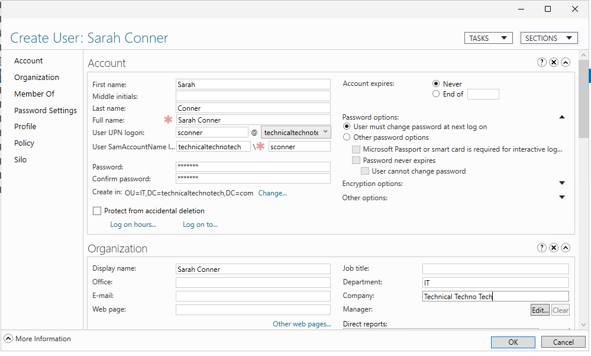
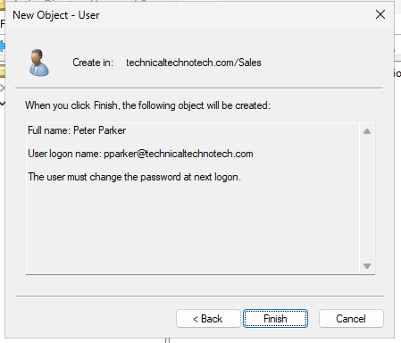
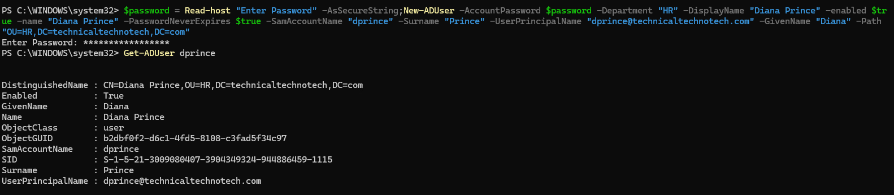
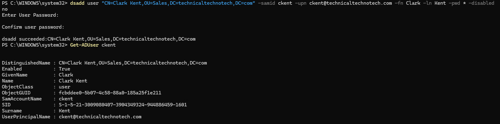

# AD DS User Management with Multiple Administrative Tools

### Project Overview

This lab demonstrates multiple methods for creating and managing user objects in Active Directory Domain Services (AD DS) within the Technical Techno Tech environment.

Five different administrative tools were used:

* **Active Directory Administrative Center (ADAC)**
* **Active Directory Users and Computers (ADUC)**
* **Windows Admin Center (WAC)**
* **Windows PowerShell**
* **dsadd**

The goal was to practice multiple AD DS administration methods and understand how different management tools interact with the same Active Directory environment.

***

### Lab Environment

Domain: technicaltechnotech.com

Systems:

* DC01 — Domain Controller
* DC02 — Domain Controller
* MGMT01 — Administrative Workstation

Organizational Units:

* IT
* HR
* Sales
* Executives

Administrative tasks were primarily performed remotely from MGMT01.

***

Scenario

Technical Techno Tech hired several new employees across different departments.

As the administrator, I was responsible for creating their AD DS accounts and organizing them into the appropriate Organizational Units.

To demonstrate familiarity with multiple AD DS management methods, each employee account was created using a different administrative tool.

| Employee      | Username	| Department | Tool                                  |
| :-------------|:----------|:-----------|:--------------------------------------|
| Sarah Connor	|sconnor	|IT	         |Active Directory Administrative Center |
| Peter Parker	|pparker	|Sales	     |Active Directory Users and Computers   |
| Bruce Wayne	|bwayne	    |Executives	 |Windows Admin Center                   |
| Diana Prince	|dprince	|HR	         |Windows PowerShell                     |
| Clark Kent	|ckent	    |Sales	     |dsadd                                  |

***

## Task 1 — Active Directory Administrative Center

I used Active Directory Administrative Center (ADAC) from MGMT01 to create the first user account.

User

* Name: Sarah Connor
* Username: sconnor
* Department: IT
* Account Enabled: Yes
* Change Password at Next Logon: Yes

Result

Sarah Connor was successfully created as an AD DS user and placed inside the IT OU.

Screenshot

Add screenshot of Sarah Connor in ADAC.


***

## Task 2 — Active Directory Users and Computers

I used Active Directory Users and Computers (ADUC) to create a Sales department user.

User

* Name: Peter Parker
* Username: pparker
* Department: Sales
* Account Enabled: Yes
* Change Password at Next Logon: Yes

Result

Peter Parker was successfully created directly inside the Sales OU.

Screenshot



***

## Task 3 — Windows Admin Center

I installed the Active Directory extension for Windows Admin Center and used it to create an AD DS user remotely.

User

* Name: Bruce Wayne
* Username: bwayne
* Department: Executives

Issue Encountered

Windows Admin Center successfully created the domain user, but the Active Directory extension did not provide the same OU placement options available through tools such as ADUC.

Bruce Wayne was therefore created outside the desired Executives OU.

Resolution

I used the ActiveDirectory PowerShell module to move the existing user object into the correct OU.

```powershell
Get-ADUser bwayne | Move-ADObject -TargetPath "OU=Executives,DC=technicaltechnotech,DC=com"
```

I then verified Bruce Wayne’s Distinguished Name to confirm the account had been moved successfully.

```powershell
Get-ADUser bwayne
```

The resulting Distinguished Name contained:

```
CN=Bruce Wayne,OU=Executives,DC=technicaltechnotech,DC=com
```

What This Demonstrated

Different AD DS administrative tools do not necessarily expose every capability through the same interface.

Administrators can combine tools such as Windows Admin Center, ADUC, and PowerShell to complete administrative workflows.

Screenshot

[Bruce Wayne in Windows Admin Center](./bwayne.png)

***

## Task 4 — Windows PowerShell

I used the ActiveDirectory PowerShell module to create Diana Prince.

User

* Name: Diana Prince
* Username: dprince
* UPN: dprince@technicaltechnotech.com
* Department: HR
* Account Enabled: Yes
* Change Password at Next Logon: Yes

Secure Password

Instead of placing the temporary password directly inside the PowerShell command, I stored it as a SecureString.

```powershell
$password = Read-Host "Enter temporary password" -AsSecureString
```

The password could then be supplied to New-ADUser using:

```powershell
-AccountPassword $password
```

OU Placement

PowerShell uses the -Path parameter to specify where the new AD object should be created.

```powershell
-Path "OU=HR,DC=technicaltechnotech,DC=com"
```

Verification

I verified the account using:

```powershell
Get-ADUser dprince
```

This confirmed:

* The account existed
* The account was enabled
* The sAMAccountName was correct
* The UPN was correct
* The account was located inside the HR OU

Screenshot



***

## Task 5 — dsadd

For the final user, I used the traditional Windows dsadd command-line utility.

User

* Name: Clark Kent
* Username: ckent
* UPN: ckent@technicaltechnotech.com
* Department: Sales
* Account Enabled: Yes
* Change Password at Next Logon: Yes

Command

```powershell
dsadd user "CN=Clark Kent,OU=Sales,DC=technicaltechnotech,DC=com" -samid ckent -upn ckent@technicaltechnotech.com -fn Clark -ln Kent -pwd * -mustchpwd yes -disabled no
```

Using:

-pwd *

allowed the password to be entered interactively rather than exposing the password directly in the command.

Verification

I verified the account using PowerShell:

```powershell
Get-ADUser ckent
```

The Distinguished Name confirmed that Clark Kent was created directly inside the Sales OU.

Screenshot



⸻

Final Active Directory Structure

After completing the lab, the department structure was:

```
technicaltechnotech.com
│
├── IT
│   └── Sarah Connor
│
├── HR
│   └── Diana Prince
│
├── Sales
│   ├── Peter Parker
│   └── Clark Kent
│
└── Executives
    └── Bruce Wayne
```
***

Management Tools Compared

|Tool	              |Interface  |	Purpose                                                |
|:--------------------|:----------|:-------------------------------------------------------|
|ADAC	              |GUI	      |Modern Active Directory administration                  |
|ADUC	              |GUI	      |Traditional user, computer, group, and OU administration|
|Windows Admin Center |Web GUI	  |Browser-based Windows Server and AD administration      |
|PowerShell	          |CLI	      |Scriptable and automated AD DS administration           |
|dsadd	              |CLI	      |Traditional command-line AD DS administration           |

Although the interfaces differ, they ultimately perform operations against the same Active Directory environment.

***

Key Commands

```powershell
Import-Module ActiveDirectory

Get-ADUser dprince

$password = Read-Host "Enter temporary password" -AsSecureString

-Path "OU=HR,DC=technicaltechnotech,DC=com"

Get-ADUser bwayne | Move-ADObject -TargetPath "OU=Executives,DC=technicaltechnotech,DC=com"

dsadd user "CN=Clark Kent,OU=Sales,DC=technicaltechnotech,DC=com" -samid ckent -upn ckent@technicaltechnotech.com -fn Clark -ln Kent -pwd * -mustchpwd yes -disabled no
```
***

### What I Learned

* Created AD DS users using five different administrative methods.
* Managed Active Directory remotely from a dedicated management workstation.
* Learned the difference between a UPN and SAMAccountName.
* Used Distinguished Names to identify locations within Active Directory.
* Used PowerShell’s -Path parameter to specify an object’s destination OU.
* Used Move-ADObject to relocate an existing AD user.
* Used SecureString for safer password handling in PowerShell.
* Used the ActiveDirectory PowerShell module for AD DS administration.
* Learned the difference between PowerShell cmdlets and traditional tools such as dsadd.
* Identified limitations of the Windows Admin Center Active Directory extension.
* Verified AD DS changes using multiple administrative tools.

***

### Skills Practiced

* Active Directory Domain Services (AD DS)
* Active Directory Administrative Center (ADAC)
* Active Directory Users and Computers (ADUC)
* Windows Admin Center (WAC)
* Windows PowerShell
* ActiveDirectory PowerShell Module
* New-ADUser
* Get-ADUser
* Move-ADObject
* dsadd
* User provisioning
* Organizational Unit management
* Distinguished Names
* User Principal Names (UPNs)
* SAMAccountName
* SecureString password handling
* Remote server administration
* AD DS troubleshooting
* Administrative tool comparison
